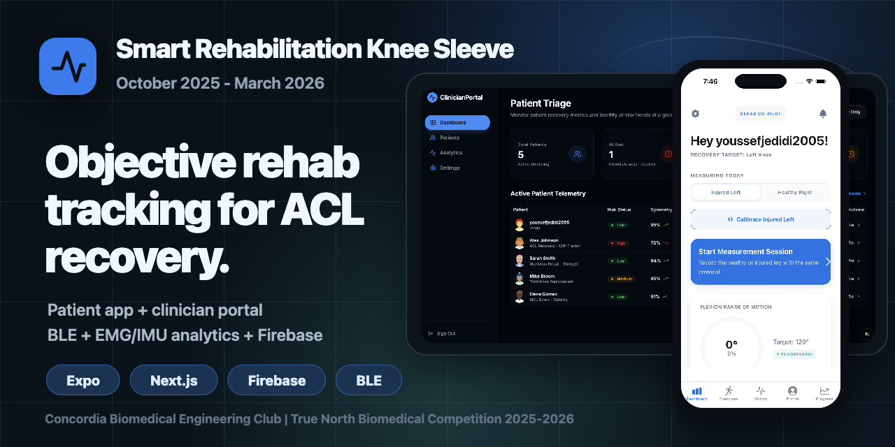
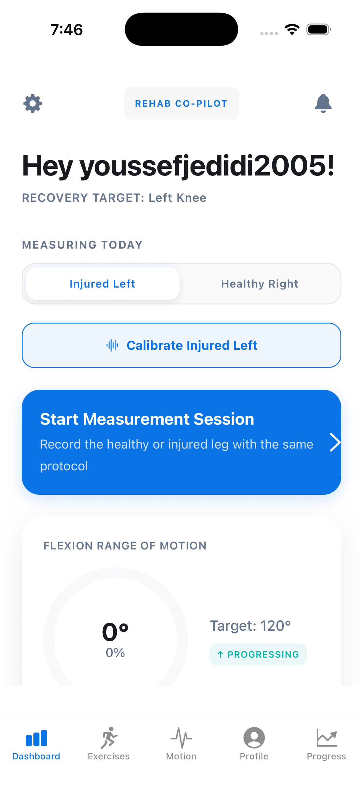
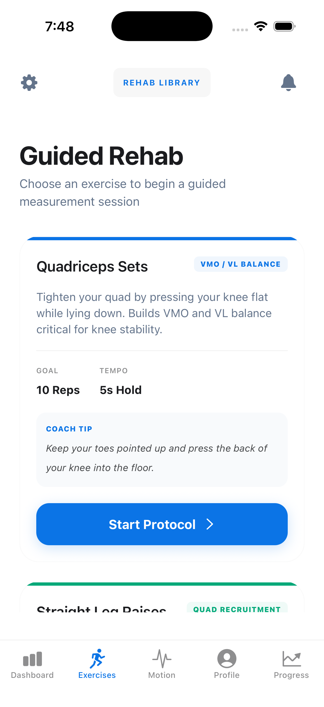
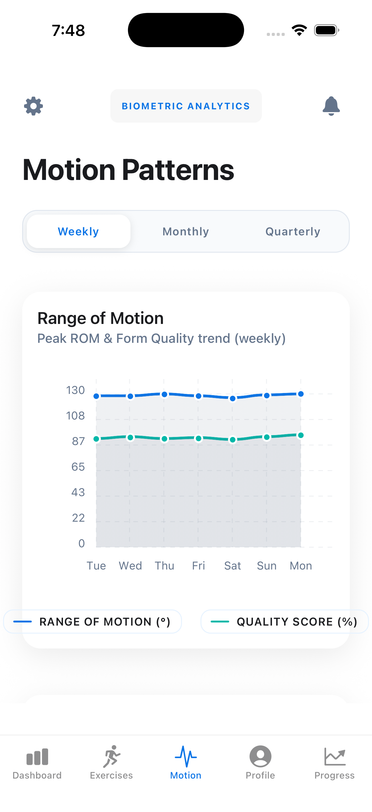
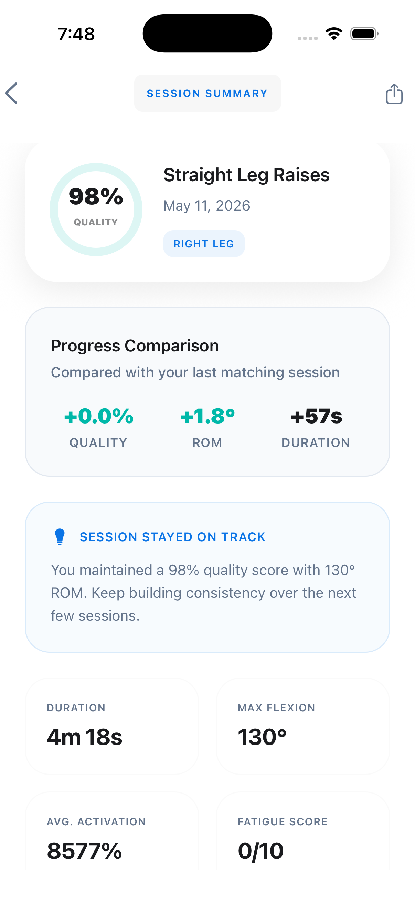
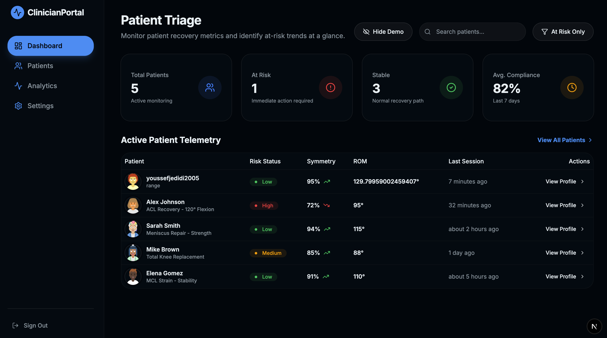
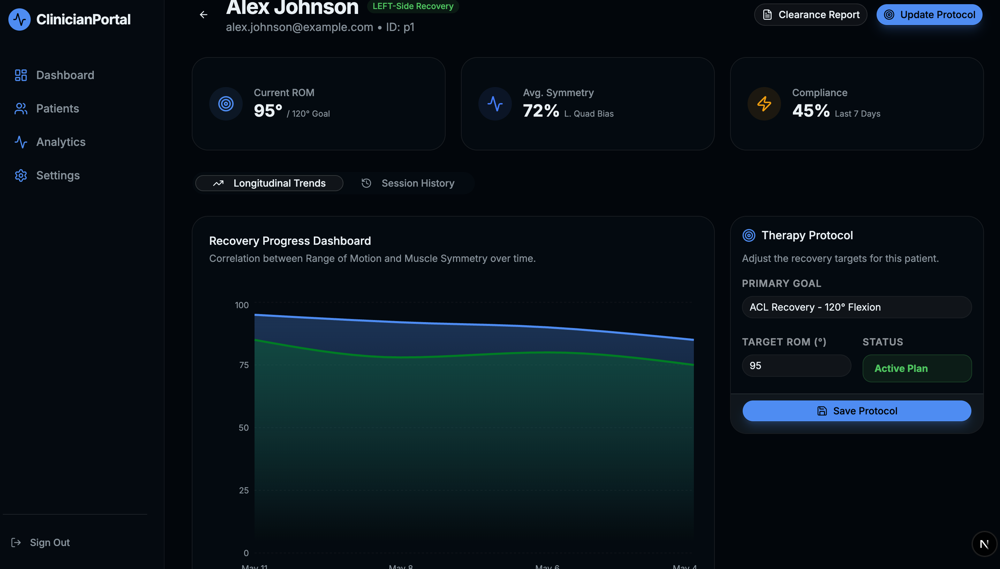
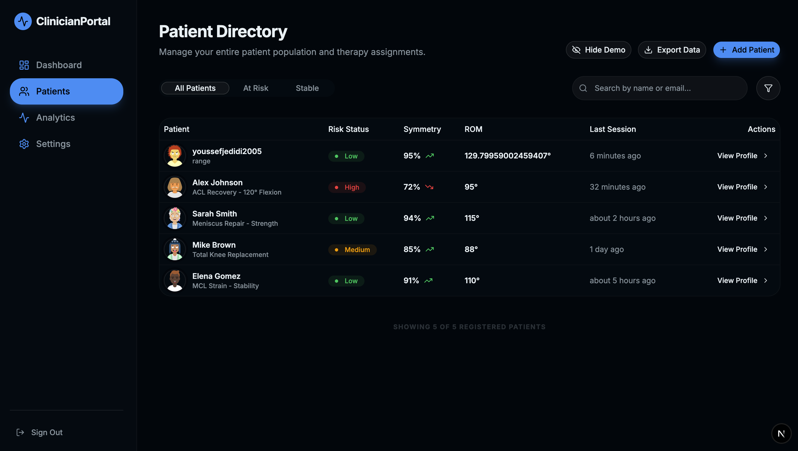

# Smart Rehabilitation Knee Sleeve

A full-stack rehabilitation monitoring platform built by the Concordia Biomedical Engineering Club for the True North Biomedical Competition 2025-2026.

Smart Sleeve combines a patient-facing mobile app, a clinician web portal, Firebase-backed sync, and a BLE-ready sensor pipeline for objective knee rehabilitation tracking. The project turns EMG and motion data into usable recovery signals: live muscle activation, knee angle trends, exercise sessions, bilateral comparison, milestones, and clinician triage.

Project duration: October 2025 - March 2026.

> Educational and competition prototype. Not a certified medical device.



## Screenshots

### Mobile App

<p>
  
  
  
  
</p>

### Clinician Portal

<p>
  
  
</p>

<p>
  
</p>

## What It Does

- Captures 8-channel EMG and IMU telemetry from a smart knee sleeve over BLE.
- Simulates the hardware stream with a mock BLE connector for development without the sleeve.
- Filters noisy EMG data with a DSP pipeline including notch and bandpass stages.
- Tracks recovery sessions, knee angle, muscle activation, calibration, and symmetry.
- Supports patient onboarding, Firebase authentication, local SQLite storage, and cloud sync.
- Gives clinicians a web dashboard for patient triage, risk flags, telemetry review, and goal prescription.

## Product Surfaces

| Surface | Path | Purpose |
| --- | --- | --- |
| Mobile app | `smart-sleeve-app/` | React Native / Expo app for patients and hardware testing |
| Clinician portal | `clinician-portal/` | Next.js dashboard for clinical monitoring |
| Backend rules | `firestore.rules` | Firestore access model for patient and clinician data |
| Hardware docs | `docs/hardware_setup_guide.md` | Sleeve wiring, firmware, BLE, and troubleshooting workflow |
| ML workspace | `ml/` | Machine learning notes and experimentation workspace |

## Tech Stack

- Mobile: Expo SDK 54, React Native, TypeScript, Expo Router, Redux Toolkit, Redux Persist
- Web portal: Next.js, React, TypeScript, Tailwind CSS, shadcn-style UI, Recharts
- Data: Firebase Authentication, Firestore, local SQLite, offline-aware sync
- Hardware: ESP32 BLE workflow, EMG channels, IMU telemetry, mock hardware service
- Signal processing: custom IIR filters, feature extraction, calibration, normalized display modes
- Quality: Jest tests, Expo linting, Next.js linting, GitHub Actions

## Quick Start

Clone the repository:

```bash
git clone https://github.com/Concordia-Biomedical-Engineering-Club/smart-sleeve-app.git
cd smart-sleeve-app
```

### Mobile App

```bash
cd smart-sleeve-app
npm install
cp .env.example .env
npm start
```

Use Expo to open the app on web, simulator, or a native development build. Full BLE testing requires a native build because the app uses `react-native-ble-plx`.

```bash
npx expo run:android
npx expo run:ios
```

For dev-client builds, keep Metro running:

```bash
npx expo start --dev-client
```

### Clinician Portal

```bash
cd clinician-portal
npm install
cp .env.example .env.local
npm run dev
```

Open [http://localhost:3000](http://localhost:3000). The portal uses Firebase auth and shows demo patient data when no real patient profiles are available.

## Environment

Do not commit real Firebase credentials or private keys. Use local `.env` files and keep only placeholder templates in source control.

Mobile app variables are loaded from `smart-sleeve-app/.env`:

```bash
EXPO_PUBLIC_FIREBASE_API_KEY=
EXPO_PUBLIC_FIREBASE_AUTH_DOMAIN=
EXPO_PUBLIC_FIREBASE_PROJECT_ID=
EXPO_PUBLIC_FIREBASE_STORAGE_BUCKET=
EXPO_PUBLIC_FIREBASE_MESSAGING_SENDER_ID=
EXPO_PUBLIC_FIREBASE_APP_ID=
EXPO_PUBLIC_USE_MOCK_HARDWARE=true
```

The clinician portal uses equivalent Firebase values in `clinician-portal/.env.local`.

## Development Commands

From `smart-sleeve-app/`:

```bash
npm test
npm run lint
npm run web
npx expo run:android
npx expo run:ios
```

From `clinician-portal/`:

```bash
npm run dev
npm run build
npm run lint
```

## Hardware Workflow

For physical sleeve testing:

1. Flash `firmware/esp32_ble_sleeve.ino` to the ESP32 target.
2. Set `EXPO_PUBLIC_USE_MOCK_HARDWARE=false`.
3. Start Metro with `npx expo start --dev-client`.
4. Install a native app build with `npx expo run:android` or `npx expo run:ios`.
5. Open the BLE diagnostics screen and confirm packet counters are increasing.

See [docs/hardware_setup_guide.md](docs/hardware_setup_guide.md) for wiring, BLE characteristics, firmware notes, and troubleshooting.

## Repository Structure

```text
.
|-- smart-sleeve-app/       # Expo patient app
|-- clinician-portal/       # Next.js clinician dashboard
|-- docs/                   # Hardware, calibration, screenshots, and reference docs
|-- ml/                     # ML experiments and documentation
|-- backend/                # Backend placeholder/workspace
|-- firestore.rules         # Firestore security rules
`-- .github/workflows/      # CI workflows
```

## Status

The competition prototype is feature-complete for demo and presentation use:

- Patient app auth, onboarding, dashboard, exercises, progress, calibration, and BLE diagnostics
- Mock hardware stream for repeatable demos
- Signal processing and normalization services
- Clinician portal with demo triage data, patient list, analytics, and settings
- Firebase auth and Firestore integration points
- Firestore rules and CI configuration

## Disclaimer

This project is for educational, competition, and portfolio purposes only. It is not a substitute for professional medical advice, diagnosis, or treatment, and it is not a certified medical device. Always consult a qualified healthcare professional for medical concerns.

## License

This project is licensed under the GNU Affero General Public License v3.0. See [LICENSE](LICENSE) for details.

## Contact

Project lead: Youssef Jedidi  
Email: `youssefjedidi2022 [at] gmail [dot] com`  
LinkedIn: [Youssef Jedidi](https://www.linkedin.com/in/youssef-jedidi/)

Project: [Concordia-Biomedical-Engineering-Club/smart-sleeve-app](https://github.com/Concordia-Biomedical-Engineering-Club/smart-sleeve-app)
